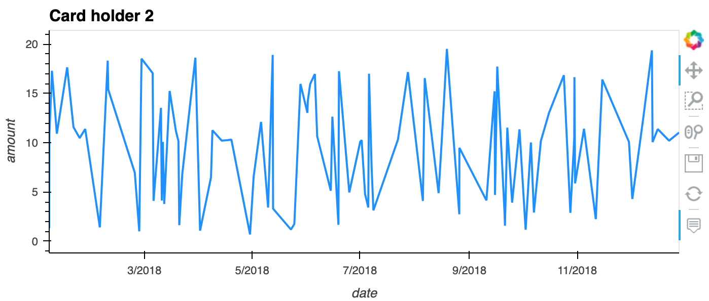
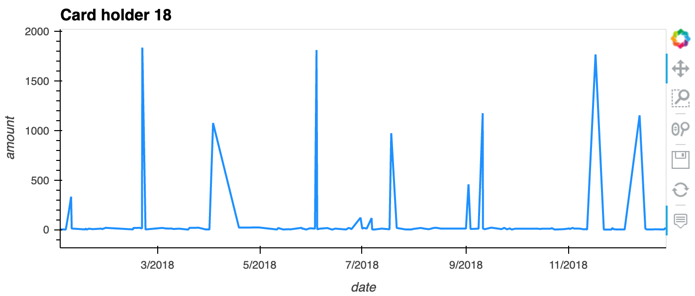
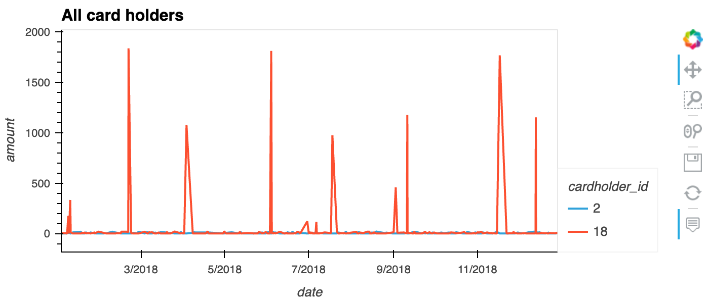
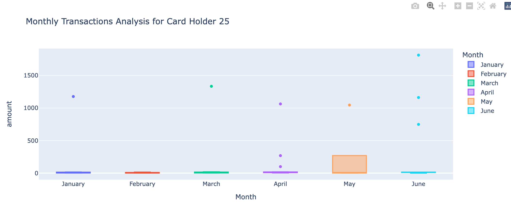

# Detecting Suspicious Transactions

## Data Analysis

### Small Transactions

Based on the number of transactions per cardholder, no fraudulent activity appears to be present. There are a reasonable amount of small transactions per card holder given the time period of one year.

| # | Cardholder ID | Payment < $2.00 |
|---|---------------|-----------------|
|1	|12 |26
|2	|19 |22
|3	|24 |22
|4	|11 |21
|5	|10 |20
|6	|16 |19
|7	|18 |19
|8	|13 |19
|9	|20 |18
|10	|7  |18
|11	|25 |16
|12	|23 |16
|13	|4  |16
|14	|8  |15
|15	|5  |14
|16	|15 |12
|17	|2  |11
|18	|1  |10
|19	|14 |9
|20	|22 |7
|21	|6  |6
|22	|17 |4
|23	|21 |4
|24	|9  |3
|25	|3  |3

### Top 100 Highest Transactions between 7:00am and 9:00am

Hot dog! It appears there is a fradulent transaction in row 2. Rather than two decimal places, its **amount** has 13. This is not in line with the majority of transactions, so it raises a flag.

Although there is fraudulent activity during this time frame, the early morning is no more prevalent than other times of the day. This is evident as the fraudulent transactions in our database occur at nearly evenly spread time intervals.

| # | Merchant ID | Amount | Timestamp |
|---|-------------|--------|-----------|
|1|9|1894|Fri Dec 07 2018 07:22:03 GMT-0500|
|2|4|1617.0000000000002|Mon Mar 05 2018 08:26:08 GMT-0500|
|3|87|1334|Tue Mar 06 2018 07:18:09 GMT-0500|
|4|144|1131|Mon Jan 22 2018 08:07:03 GMT-0500|
|5|134|1060|Wed Sep 26 2018 08:48:40 GMT-0400|
|6|135|1017|Thu Sep 06 2018 08:28:55 GMT-0400|
|7|111|1009|Mon Mar 26 2018 07:41:59 GMT-0400|
|8|96|748|Fri Dec 14 2018 08:51:41 GMT-0500|
|9|111|100|Sun Apr 01 2018 07:17:21 GMT-0400|
|10|147|23.13|Sun Aug 26 2018 07:15:18 GMT-0400|
|11|128|20.71|Tue Aug 28 2018 07:17:14 GMT-0400|
|12|89|20.44|Sun Oct 07 2018 08:16:54 GMT-0400|
|13|96|19.86|Thu Oct 18 2018 07:16:04 GMT-0400|
|14|23|19.5|Sat Mar 03 2018 08:42:02 GMT-0500|
|15|63|19.49|Mon Jun 04 2018 08:30:28 GMT-0400|
|16|96|19.34|Mon Mar 26 2018 08:08:27 GMT-0400|
|17|79|19.33|Fri Jun 01 2018 08:56:59 GMT-0400|
|18|35|19.27|Sun Dec 23 2018 07:39:47 GMT-0500|
|19|99|19.02|Sun Sep 23 2018 07:30:56 GMT-0400|
|20|23|18.98|Wed Feb 21 2018 08:21:10 GMT-0500|
|21|34|18.93|Thu Aug 02 2018 07:44:24 GMT-0400|
|22|26|18.93|Wed Jul 04 2018 08:51:29 GMT-0400|
|23|65|18.82|Sat Jun 09 2018 07:29:28 GMT-0400|
|24|86|18.76|Sat Jun 02 2018 07:45:48 GMT-0400|
|25|76|18.72|Sat Jan 06 2018 08:42:50 GMT-0500|
|26|44|18.6|Sun Jun 24 2018 07:28:48 GMT-0400|
|27|64|18.56|Sat Jun 23 2018 07:12:06 GMT-0400|
|28|55|18.54|Tue Aug 14 2018 08:38:49 GMT-0400|
|29|81|18.53|Sun Oct 07 2018 07:08:08 GMT-0400|
|30|6|18.52|Tue Feb 27 2018 08:27:00 GMT-0500|
|31|26|18.48|Wed Sep 12 2018 07:33:19 GMT-0400|
|32|76|18.35|Sat Jan 06 2018 07:00:32 GMT-0500|
|33|69|18.3|Sun Feb 18 2018 08:54:19 GMT-0500|
|34|43|18.14|Sun Feb 25 2018 07:55:21 GMT-0500|
|35|1|17.85|Mon Feb 05 2018 08:37:24 GMT-0500|
|36|106|17.8|Sun Sep 02 2018 07:36:42 GMT-0400|
|37|85|17.78|Sun Apr 15 2018 08:32:38 GMT-0400|
|38|61|17.73|Mon Apr 09 2018 07:08:11 GMT-0400|
|39|102|17.56|Wed Jun 13 2018 08:46:29 GMT-0400|
|40|104|17.54|Thu Jan 18 2018 08:18:50 GMT-0500|
|41|137|17.53|Thu Jan 18 2018 08:58:13 GMT-0500|
|42|47|17.48|Sun May 20 2018 08:36:46 GMT-0400|
|43|56|17.47|Sat Jun 02 2018 07:44:39 GMT-0400|
|44|116|17.36|Tue Jan 16 2018 08:02:04 GMT-0500|
|45|96|17.13|Fri Dec 28 2018 07:02:38 GMT-0500|
|46|122|17.03|Fri Jun 08 2018 07:31:57 GMT-0400|
|47|127|16.85|Mon Oct 29 2018 07:18:34 GMT-0400|
|48|32|16.85|Sun Oct 28 2018 07:02:33 GMT-0400|
|49|62|16.65|Mon Apr 23 2018 08:18:49 GMT-0400|
|50|66|16.64|Thu May 03 2018 07:20:28 GMT-0400|
|51|135|16.58|Mon Mar 05 2018 07:34:15 GMT-0500|
|52|94|16.38|Sun Feb 18 2018 07:25:42 GMT-0500|
|53|67|16.36|Wed Mar 28 2018 07:36:02 GMT-0400|
|54|61|16.35|Sun Dec 16 2018 08:41:53 GMT-0500|
|55|101|16.28|Sat Jan 06 2018 08:49:34 GMT-0500|
|56|83|16.21|Tue Jul 17 2018 08:10:36 GMT-0400|
|57|10|16.16|Sun Jun 10 2018 07:55:27 GMT-0400|
|58|34|16.07|Wed Apr 11 2018 08:26:52 GMT-0400|
|59|73|15.98|Thu Sep 06 2018 08:35:35 GMT-0400|
|60|47|15.98|Tue Jun 19 2018 07:16:54 GMT-0400|
|61|128|15.96|Mon May 28 2018 07:57:39 GMT-0400|
|62|141|15.94|Tue Jun 26 2018 08:00:22 GMT-0400|
|63|25|15.94|Tue Oct 30 2018 07:08:04 GMT-0400|
|64|120|15.37|Sun May 20 2018 07:05:42 GMT-0400|
|65|21|15.21|Sun Jan 14 2018 07:33:54 GMT-0500|
|66|71|15.15|Sat Jan 27 2018 08:36:58 GMT-0500|
|67|138|15.1|Sun Feb 25 2018 08:23:37 GMT-0500|
|68|127|15.05|Sun Jun 10 2018 08:20:40 GMT-0400|
|69|33|15.04|Fri Apr 20 2018 08:27:59 GMT-0400|
|70|34|14.94|Wed Sep 26 2018 07:52:23 GMT-0400|
|71|71|14.92|Tue Dec 11 2018 07:42:50 GMT-0500|
|72|23|14.8|Sat Apr 07 2018 07:18:20 GMT-0400|
|73|14|14.42|Thu Aug 02 2018 07:13:49 GMT-0400|
|74|83|14.36|Sat Dec 15 2018 08:34:15 GMT-0500|
|75|147|14.3|Tue Apr 24 2018 07:41:49 GMT-0400|
|76|129|13.83|Mon Oct 22 2018 07:41:56 GMT-0400|
|77|123|13.59|Mon Sep 03 2018 07:27:55 GMT-0400|
|78|109|13.53|Sat Mar 10 2018 08:52:09 GMT-0500|
|79|86|13.52|Fri Apr 27 2018 08:08:38 GMT-0400|
|80|21|13.46|Mon Feb 26 2018 07:31:20 GMT-0500|
|81|136|12.98|Tue May 01 2018 07:40:00 GMT-0400|
|82|3|12.98|Sat Oct 27 2018 08:04:44 GMT-0400|
|83|103|12.96|Fri Mar 30 2018 08:12:28 GMT-0400|
|84|89|12.67|Wed Jan 17 2018 07:31:03 GMT-0500|
|85|116|12.52|Wed Aug 08 2018 08:36:23 GMT-0400|
|86|48|12.5|Mon Jul 30 2018 08:49:16 GMT-0400|
|87|110|12.32|Fri Nov 30 2018 08:52:20 GMT-0500|
|88|6|12.25|Sat Dec 29 2018 08:11:55 GMT-0500|
|89|149|12.17|Mon Feb 19 2018 08:50:36 GMT-0500|
|90|121|11.96|Sat Jan 20 2018 08:35:34 GMT-0500|
|91|132|11.93|Tue Jul 31 2018 07:44:59 GMT-0400|
|92|2|11.91|Wed Jan 17 2018 07:56:09 GMT-0500|
|93|20|11.88|Fri Jun 08 2018 07:25:30 GMT-0400|
|94|54|11.87|Mon Dec 31 2018 08:22:17 GMT-0500|
|95|122|11.86|Thu Aug 30 2018 08:46:49 GMT-0400|
|96|83|11.73|Sun Apr 08 2018 07:06:20 GMT-0400|
|97|128|11.72|Sat Sep 15 2018 08:33:49 GMT-0400|
|98|80|11.7|Tue Dec 18 2018 07:45:28 GMT-0500|
|99|107|11.68|Sun Feb 25 2018 07:37:03 GMT-0500|
|100|16|11.65|Fri May 04 2018 08:21:59 GMT-0400|

### Top 5 Vulnerable Merchants

Based on the highest frequency of small transactions, these are the top 5 merchants vulnerable to this type of fraud.

| # | Merchant ID | Name | Small Transactions |
|---|-------------|------|--------------------|
|1|141|Wood-Ramirez|7|
|2|145|Hood-Phillips|6|
|3|48|Baker Inc|6|
|4|119|Henderson and Sons|5|
|5|30|Atkinson Ltd|5|

### Transaction Patterns

Card holder 2 has a record of consistent transaction amounts between $1 and $20. It appears nothing suspicious is happening here.

Card holder 18 displays a pattern of anomalous transaction amounts. There is cause for suspicion of fraudulent transactions here because the anomalous transaction amounts are much larger than the transaction amounts made between them.

On the other hand, this card holder may simply be using the same credit card for daily spending *and* making large purchases. More data may be required to determine if fraud is present.

Based on the comparison between the two credit card transaction histories, it is clear that the anomalous transaction values are far outside of the standard deviation. This would further suggest that fraud is present.

In this box plot, outliers occur about 1.5 times per month. May's upper quartile group is much higher than the other months, suggesting that this could be a month to zoom in on for more fraudulent activity.

